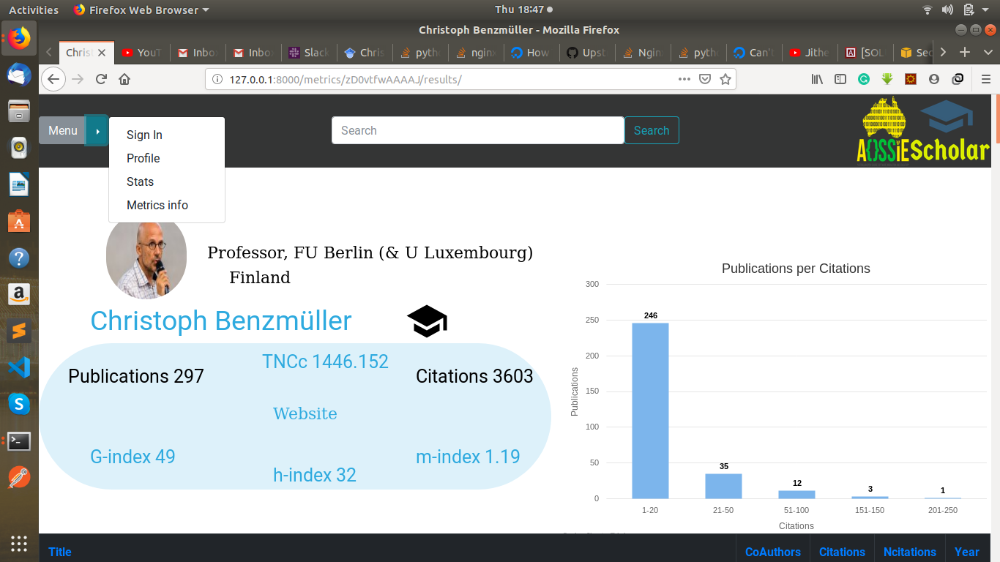
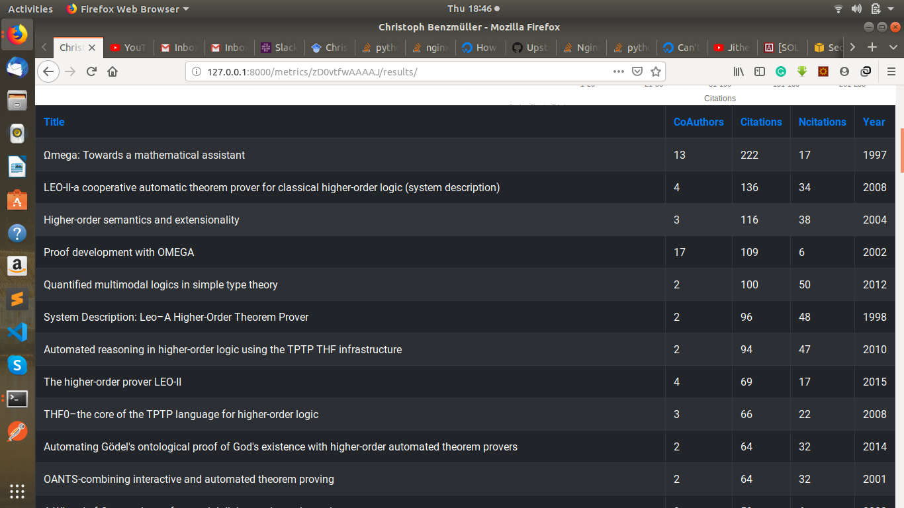
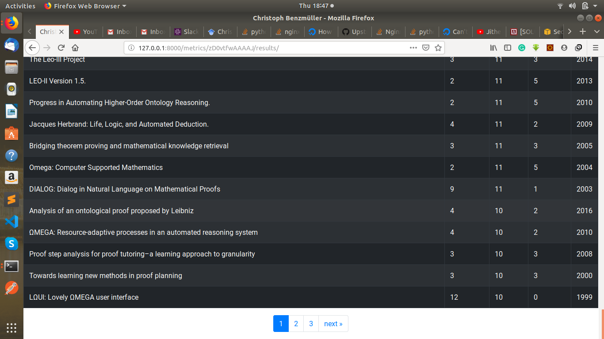
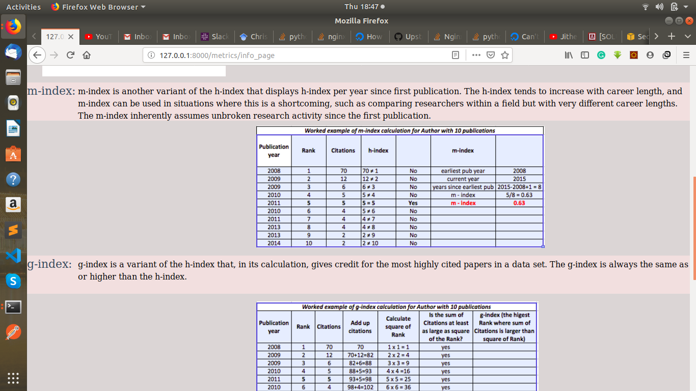
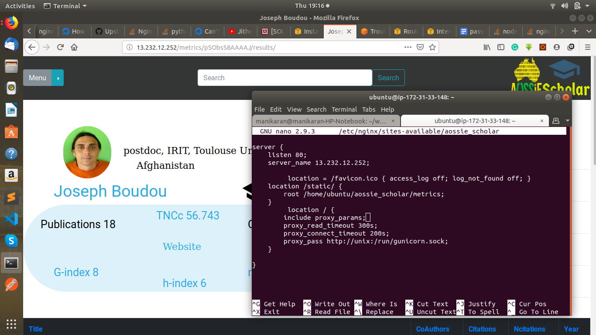
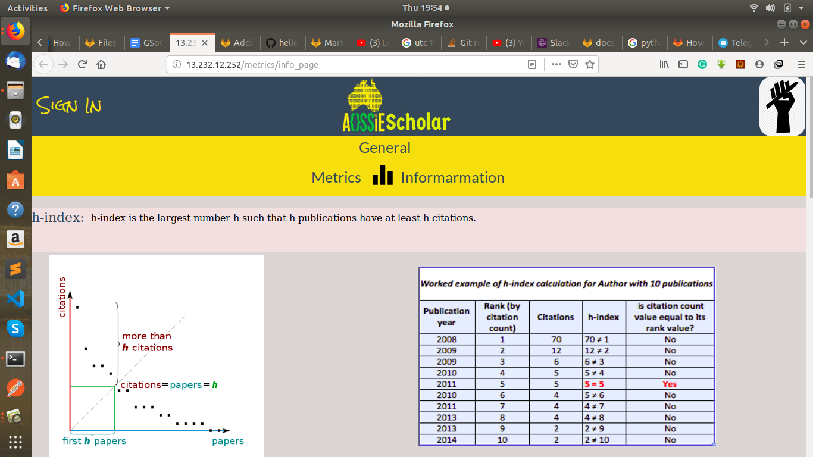
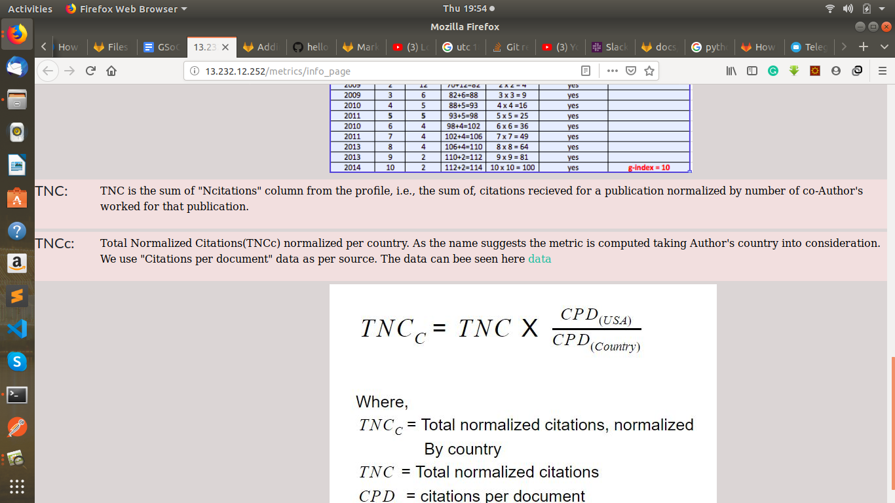
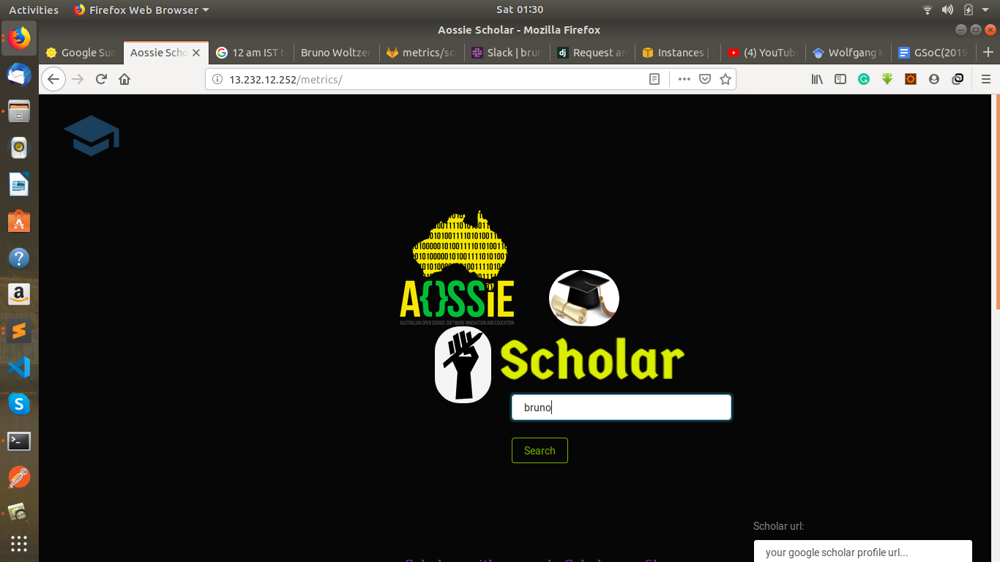
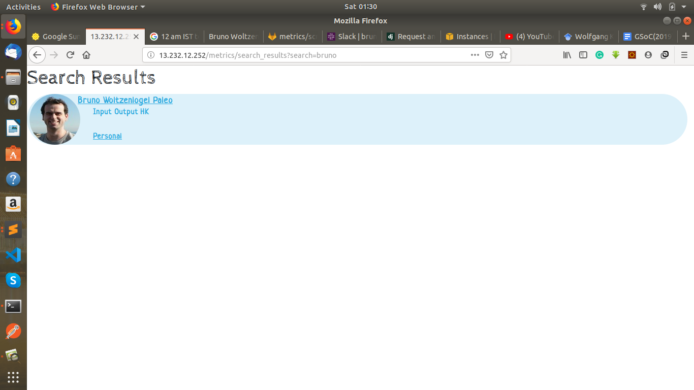

# 

## Aossie-Scholar web app for Aossie (GSOC 2019) By Manikaran Singh

# Aossie-Scholar

The project is related to Google Scholar profiles and metrics. Many researchers have a Google Scholar profile. 
It is used by people to see how many papers a researcher has written, how many citations they have received, their h-index, i10-index... 
But these metrics are flawed. The goal of the project would be to extract information from Google Scholar and compute better metrics about a researcher's performance.
And then display this information and metrics with more fairer stats in another website.

### This Branch contains all work done By Manikaran Singh during Google Summer of Code 2019

[Final GSoC Report of Aossie-Scholar website](https://docs.google.com/document/d/1nfCF9jkd8i678sxWSRwS4kjNlXcWteATjSpyIOLkbmw/edit?usp=sharing)

[Link to commits](https://gitlab.com/Manikaran20/aossie-scholar/commits/local)

[More commits](https://gitlab.com/Manikaran20/aossie-scholar/commits/dep)

Deployed project app can be viewed [here](http://13.232.12.252/metrics/)

## Some screenshots of the app

# 
# 
# 
# 
# 
# 
# 
# 
# 

